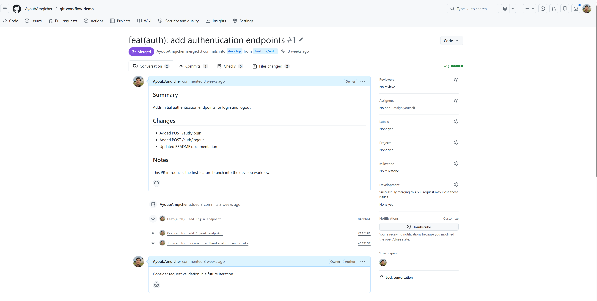
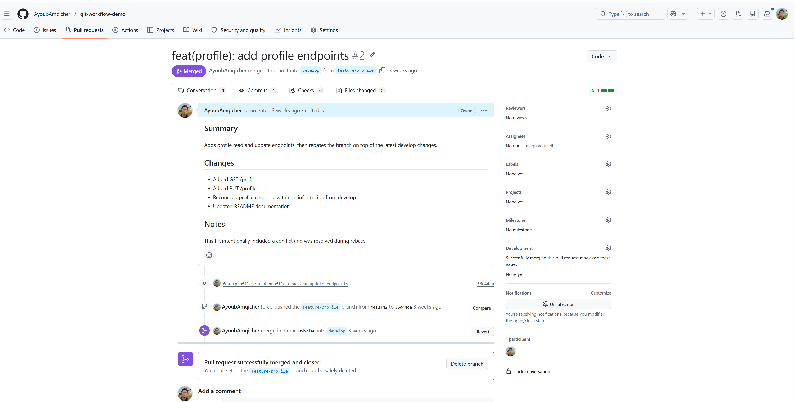
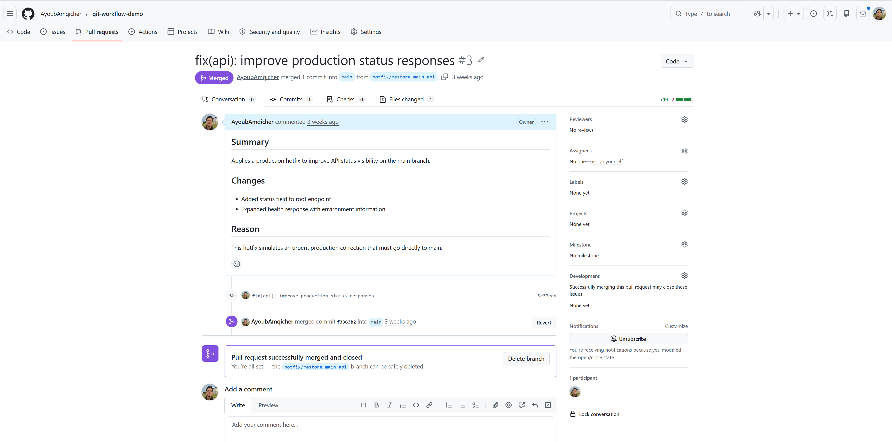

# Git Workflow Demo Clean

A small FastAPI project built to demonstrate a professional Git workflow using `main`, `develop`, feature branches, rebasing, pull requests, conflict resolution, and hotfixes.

## Tech Stack

- Python
- FastAPI
- Uvicorn

## Run locally

```bash
pip install -r requirements.txt
uvicorn app.main:app --reload
```

## Endpoints

- `GET /`
- `GET /health`
- `POST /auth/login`
- `POST /auth/logout`
- `GET /profile`
- `PUT /profile`

## Branching Strategy

- `main`: production-ready branch
- `develop`: integration branch
- `feature/*`: feature development
- `hotfix/*`: urgent production fixes

## Git Workflow Demonstrated
- feature branch development
- pull request workflow
- rebasing onto updated `develop`
- manual conflict resolution
- hotfix merged to `main` and back to `develop`

## Pull Request Evidence 

### Auth Feature PR


### Profile Feature PR (Rebase + Merge)


### Hotfix PR (Production Fix)


## Purpose 

This repository is designed to simulate a real-world engineering workflow and serve as portfolio proof of practical Git skills.